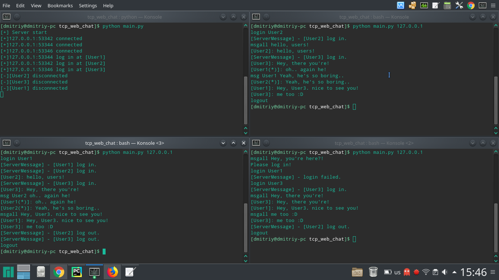

# tcp_web_chat

##### Start Update 02.08 - 12:00 #####
[Web Сервер]:

Описание:

Для написания web-версии чата использовался flask, html, js.

Возможности:

После ввода имени, пользователь может писать сообщение всем подключенным по websocket, видеть активность на сервере
(кто зашел, кто вышел). Иными словами - минимальная реализация чата на websocket (flask).

Запуск командой:

1) python run.py web

[Web-клиент]:

Доступ через браузер через порт 5000 (на локальной машине 127.0.0.1:5000)

[Bind]:

Bind - самописный модуль, связывающий web-сервер и tcp-сервер.
TCP сервер должен быть запущен до первого подключения клиента-браузера. Иначе подключенные к web-socket до запуска
TCP-сервера не будут считаться зарегистрированными для TCP соединения.
Есть возможность запускать несколько браузеров-клиентов(тестировалось на двух) отправлять сообщения всем
зарегистрированным пользователям. При "Логине" на сайте, пользователи регистрируются в базе TCP соединений.

Правильная работа:

1) login. При заходе в корень web-сервера(127.0.0.1:5000), TCP-сервер понимает, что к нему подключился
незарегистрированный пользователь. После ввода имени в браузере и нажатии на кнопку Login, подключение регистрируется
на TCP-сервере - полноценный зарегистрированный пользователь. Все пользователи "чистого" tcp-соединения дополнительно
видят активность пользователей web-соединения(login, logout)

2) msgall. При отправке сообщения в браузере, сообщение доставляется всем подключенным к websocket, а также
"дублируются" на TCP соединение. В браузере писать команду msgall писать не надо. Сообщение автоматически будет
отправлено всем.

3) logout. При отключении пользователя от web-соединения всем сообщается об этом.

Неправильная работа:

1) Связь web_to_tcp настроена приемлемо - поверхностные ошибки исправлены, глубокий анализ не проводился, однако
обратная связь tcp_to_web регистрирует изменения произошедшие в tcp-среде на web-сервере(логгирует в окно терминала),
но конечные пользователи не получают данные(пока что, разумеется).

##### End Update 02.08 - 12:00 #####

Установка:
1) git clone https://github.com/dimadeck/tcp_web_chat
2) cd tcp_web_chat

Активация и настройка виртуального окружения:

3) python -m venv env

4) source env/bin/activate

5) pip install -r requirements.txt

Запуск сервера:

6) python main.py

Запуск клиента(-ов):

7) python main.py 127.0.0.1

Сервер v.0.1:

Консольное приложение
Принимает и обрабатывает подключения клиентов (main.py <ip>).

Подключен парсер для обработки запросов по tcp(class DataParser). Проверка команд на валидность.
Связи подключение-пользователь хранятся в классе Connected.

Демонстрация работы сервера и команд login, msg, msgall, logout.

Цикл работы:

После запуска, сервер ожидает входящие подключения. При появлении нового подключения запоминает его на новом потоке.
Ожидает входа пользователя командой login <username>. Присутствует проверка на дубликаты имен. Перед подключением можно
"прощупать" синтаксис команд сервера, так как проверка на валидность команд идет перед проверкой на подключение,
однако отправлять и получать сообщения чата незарегистрированный пользователь не может. После команды login <username>
пользователь считается зарегистрированным.

Команды:
login <username> Подключить нового пользователя. Все последующие команды могут быть выполнены только после этой.

msg <username> <text> Отправить сообщение <text> пользователю с именем <username>.

msgall <text> Отправить сообщение <text> всем подключенным пользователям.

logout Выйти из чата. Так же выход должен происходить автоматически при закрытии приложения.

whoami - узнать свое имя

userlist - узнать кто онлайн

debug - показать информацию о подключениях в терминале сервера(клиент НЕ видит ее)

TCP Клиент:
Минималистичное консольное Python приложение.
Подключается к серверу по протоколу TCP, передает команды, получает сообщения от сервера и других клиентов.
